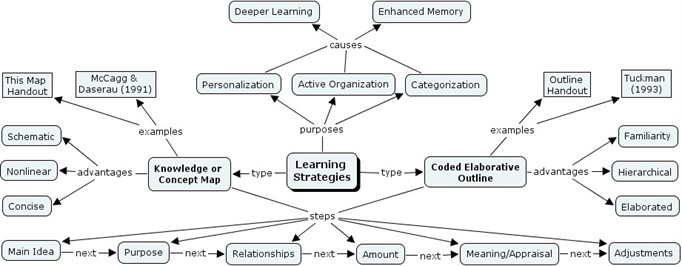

# Effective Text Processing Strategies

- Craig A. Wendorf, Ph.D.
- University of Wisconsin - Stevens Point
- cwendorf@uwsp.edu

## Overview of Text Processing Strategies

### Types of Text Processing Strategies

Text processing strategies can be defined as practices that build on known principles of the psychology of learning and memory to improve one’s ability to learn from textbooks and other written material (Tuckman, 1993). Most students are familiar with one major class of text processing strategies – the outline. However, there are other effective methods. In order to fully realize the benefits of these text processing strategies, you will need to know the major elements and types of these text processing strategies; these are summarized briefly below and clarified more on the following pages.

1. The Coded Elaborative Outline: Outlines can be effective text processing strategies. However, effective outlines are not merely shortened versions of the written material. Effective outlines have a statement of purpose, summarize the underlying concepts and their relationships, and use both shortened and elaborated statements for each main point or idea.
2. The Knowledge or Concept Map: Concept Maps are graphic representations of the relationships between concepts. Like effective outlines, effective maps have a statement of purpose and summarize the underlying concepts and their relationships. While maps do not include elaborated statements for each concept, they instead offer a visually attractive presentation.

### What Makes the Text Processing Strategies Effective?

Of course, the effectiveness of the text processing strategy depends on the quality of the product produced. Generally, the effectiveness of strategy is enhanced by following of three main guidelines:

1. The text processing strategy product ought to cover all of the necessary information. It should not cover everything, but should highlight the major concepts;
2. The text processing strategy product should have a valid structure that emphasizes the underlying conceptual relationships. Therefore, the product’s structure may differ drastically from the written source that is being summarized; and
3. The text processing strategy product should label or explicitly code those underlying conceptual relationships. This is important because it provides strong, obvious reminders about the conceptual structure.

The simplest way to assess the quality of a product is to indicate whether each of the above guidelines has been implemented. That is, an effective product is complete and concise, logically organized (according to relationships among concepts), and well-coded and elaborated (for outlines especially). Unacceptable products are incomplete or needlessly complex, disorganized or illogical (i.e., do not emphasize conceptual relationships), and are incomplete in coding and relevant details.

## A Taxonomy of Relationships Among Concepts

A taxonomy provides a pre-specified method for organizing information. Generally speaking, ideas should always be grouped to enhance your ability to recall them when necessary; how those ideas are best grouped depends on their underlying relationships. Following the work of Tuckman (1993) and Donald (2002), the tables below describe the different types of relationships that exist between concepts.

In some cases, written material (like a textbook) has grouped concepts based on this underlying type of relationship; in other cases, it has not. Your job is to group the information based on these relationships and this principle is a necessity for all types of effective text processing strategies. Again, in many cases, the product’s structure may differ drastically from the written source that is being summarized.

### Relationships Based on Similarity

| Relationship and Definition	| Sample Key Terms	| Written Example of Relationship Type |
| :- | - | - |
| Associative: Concepts are contiguous or correlated with each other | Analogous; related; parallel; similar; equivalent | “Text processing strategies like Coded Elaborative Outlines and Concept Maps are similar to each other.” |
| Functional: Concept are related because of purpose or function | Purpose; object; function; role; intention | “Text processing strategies have the purpose of organizing the material that you read.” |
| Structural: Concepts have a taxonomic or hierarchical relationship | Part; kind; type; category; characteristic; component; element | “A Concept Map is a type of strategy for learning from written material.” |
| Evidentiary: Explanation of a concrete instance of a concept | Example; evidence; instance; case | “Donald (1992) provides an example of a coding system for concept maps.” |
		
### Relationships Based on Dependency

| Relationship and Definition	| Sample Key Terms	| Written Example of Relationship Type |
| :- | - | - |
| Procedural: Concepts are ordered or sequenced as for steps or prerequisites | Next; previously; steps; before; after | “Text processing strategy products can be created using a series of steps, beginning with identifying the main idea or concept.” |
| Logical: Concepts have a logical or conditional order | Leads to; builds on; if; then; conditional | “The Coded Elaborative Outline builds on the traditional outline format.” |
| Causal: Concepts have an explicit cause-and-effect relationship | Causes; results; creates; produces; influences; impacts |“Active organization of written material results in deeper learning of the material.” |
| Critical: Explanation of the strength or weakness of a concept | Problem; solution; advantage; disadvantage | “Coded Elaborative Outlines have the advantage of being reasonably familiar.” |

## Example of an Effective Text Processing Strategy: The Coded Elaborative Outline

Purpose of this Outline: Created by Tuckman (1993), the Coded Elaborative Outline (CEO) is a specialized type of outline. It is a text processing strategy that includes (a) the organized sequence of concepts important for and related to a main idea, (b) a coding of the concepts’ relationships to the main idea using pre-determined organizational scheme, and (c) elaborations of each concept in the form of definitions or explanations. The CEO example below summarizes the main concepts and principles of text processing strategies.

<ol type="I">
  <li>Common Elements (Associative): Text processing strategies share purposes, effects, and steps
    <ol type="a">
      <li>Purposes (Functional): Why use a text processing strategy?
        <ol type="i">
          <li>Personalization: Allow you to use your own experiences to structure material</li>
          <li>Categorization: Allow you see the main points better than just reading the material</li>
          <li>Active Organization: Make you an “author” of the material rather than passive reader</li>
        </ol>
      </li>
      <li>Causes (Causal): Educational research shows that following these strategies has advantages
        <ol type="i">
          <li>Enhanced Memory: Use of strategies has been shown to increase retention of material</li>
          <li>Deeper Learning: Use of strategies has been shown to help you focus on main ideas</li>
        </ol>
      </li>
      <li>Steps (Procedural): Products of the strategies should be constructed in the following sequence
        <ol type="i">
          <li>Main Idea: Screen text to find signals that serve as cues to the main concepts</li>
          <li>Purpose: Main concepts are grouped into logical categories</li>
          <li>Relationships: Categories and concepts are organized based on relationships</li>
          <li>Amount: Main concepts and relationships should be labeled so that they are easily recalled</li>
          <li>Meaning and Appraisal: Elaboration and examples are included to enhance meaning</li>
          <li>Adjustments: Changes are made to the product when necessary</li>
        </ol>
      </li>
    </ol>
  </li>

  <li>The Coded Elaborative Outline (Structural): The CEO is a text-oriented text processing strategy
    <ol type="a">
      <li>Examples (Evidentiary): There are several examples of CEOs that are useful
        <ol type="i">
          <li>This Outline Handout: This handout is properly structured as a CEO</li>
          <li>Tuckman (1993): Tuckman provides evidence of the effectiveness of CEOs</li>
        </ol>
      </li>
      <li>Advantages (Critical): CEOs have several advantages relative to Knowledge Maps
        <ol type="i">
          <li>Familiarity: Use traditional outline format and numbering: I. A. 1. a.</li>
          <li>Hierarchical/Linear: Present information in a categorized, sequential ordering</li>
          <li>Elaborated: Include descriptions (like this sentence) that cannot easily exist in CMaps</li>
        </ol>
      </li>
    </ol>
  </li>

  <li>The Knowledge/Concept Map (Structural): The Concept Map is a schematic-oriented strategy
    <ol type="a">
      <li>Examples (Evidentiary): There are many examples of Concept Maps that are useful
        <ol type="i">
          <li>The Map Version: There is a Concept Map version of this outline</li>
          <li>McCagg & Danserau (1991): These authors provide evidence of the effectiveness of Concept Maps</li>
        </ol>
      </li>
      <li>Advantages (Critical): Concept Maps have several advantages relative to outlines
        <ol type="i">
          <li>Schematic: Maps represent conceptual relationships using text and diagrams</li>
          <li>Concise: Maps are more concise than outlines (especially CEOs)</li>
          <li>Nonlinear: Maps do not require an ordered presentation</li>
        </ol>
      </li>
    </ol>
  </li>
</ol>
 
## Example of an Effective Text Processing Strategy: The Knowledge/Concept Map

Purpose of this Concept Map: The map is a graphic representation of the relationships among concepts. It is a text processing strategy that includes (a) the labeling and organizing of concepts important for and related to a main idea, (b) a coding of the concepts’ relationships to the main idea using pre-determined organizational scheme. The example below summarizes the main concepts and principles of text processing strategies.

Additional examples are available at the [CMap Tools website](https://cmap.ihmc.us/docs/learn.php).

## Why are These Strategies Effective?

Coded Elaborative Outlines and Knowledge/Concept Maps are effective text processing strategies because they build on known principles in the psychology of learning and memory. Following the work of Tuckman (1993) and others, memory for material is best when three interrelated conditions are satisfied:

1.	The material is personalized, meaning that the information is made relevant to one’s own life and experiences. The text processing strategies described here encourage you “own” the material.
2.	The material is actively organized by the reader. The text processing strategies described here encourage you to organize the material, rather than rely on a passive reading of the written work.
3.	The material is categorized according to main concepts and especially the relationships among those concepts. This is, of course, the primary way in which the strategies described here are different from others that you may have used in the past.

Overall, each of these conditions encourages a “deeper” processing of the reading and, therefore, provides a higher likelihood of remembering the material when necessary.
 
## References

Donald, J. G. (2002). _Learning to think: Disciplinary perspectives._ San Francisco: Jossey-Bass.

McCagg, E. C., & Danserau, D. F. (1991). A convergent paradigm for examining knowledge mapping as a learning strategy. _Journal of Educational Research, 84,_ 317-324.

Tuckman, B. W. (1993). The coded elaborative outline as a strategy to help students learn from text. _Journal of Experimental Education, 62_(1), 5-13.

