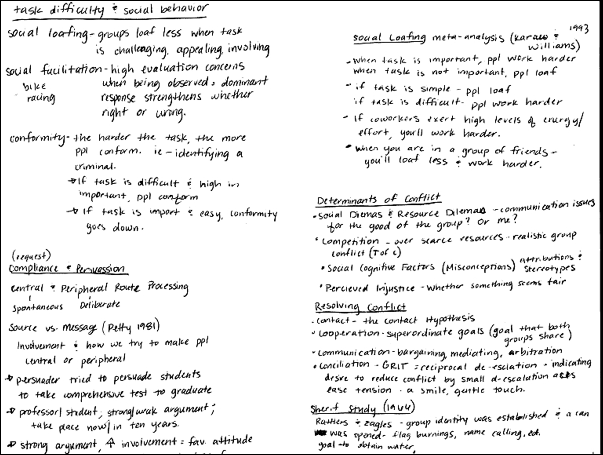
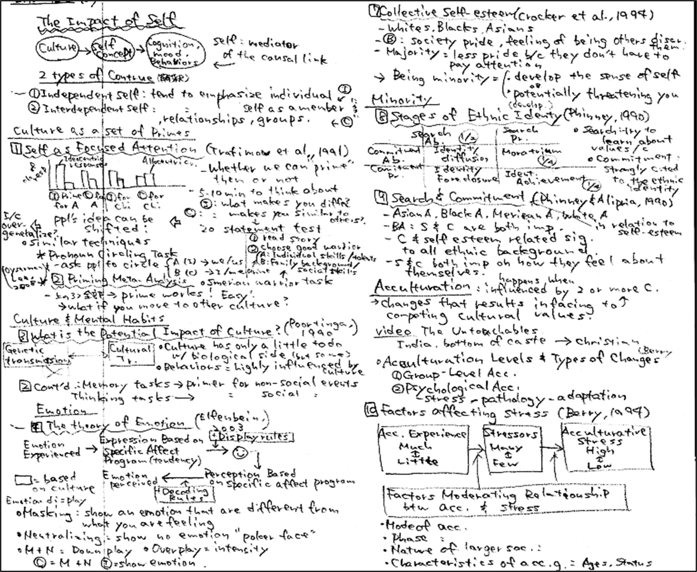
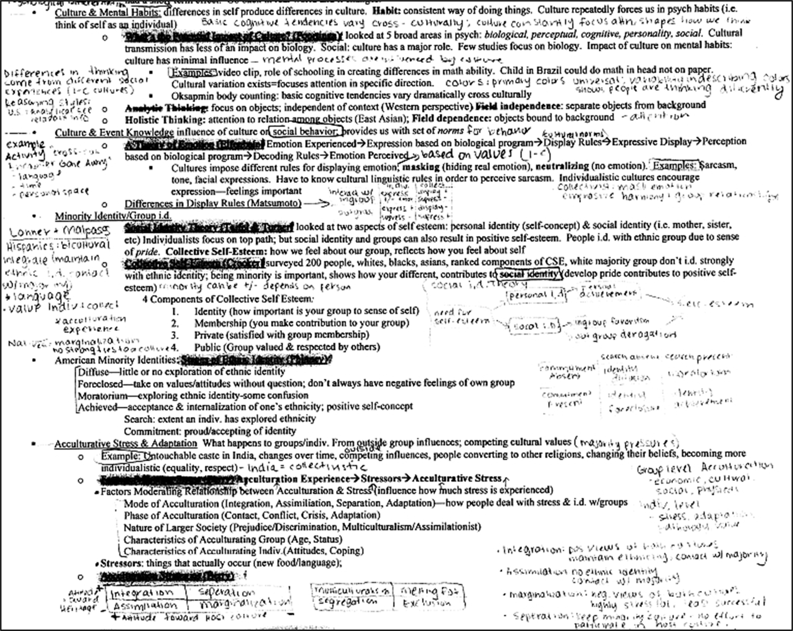
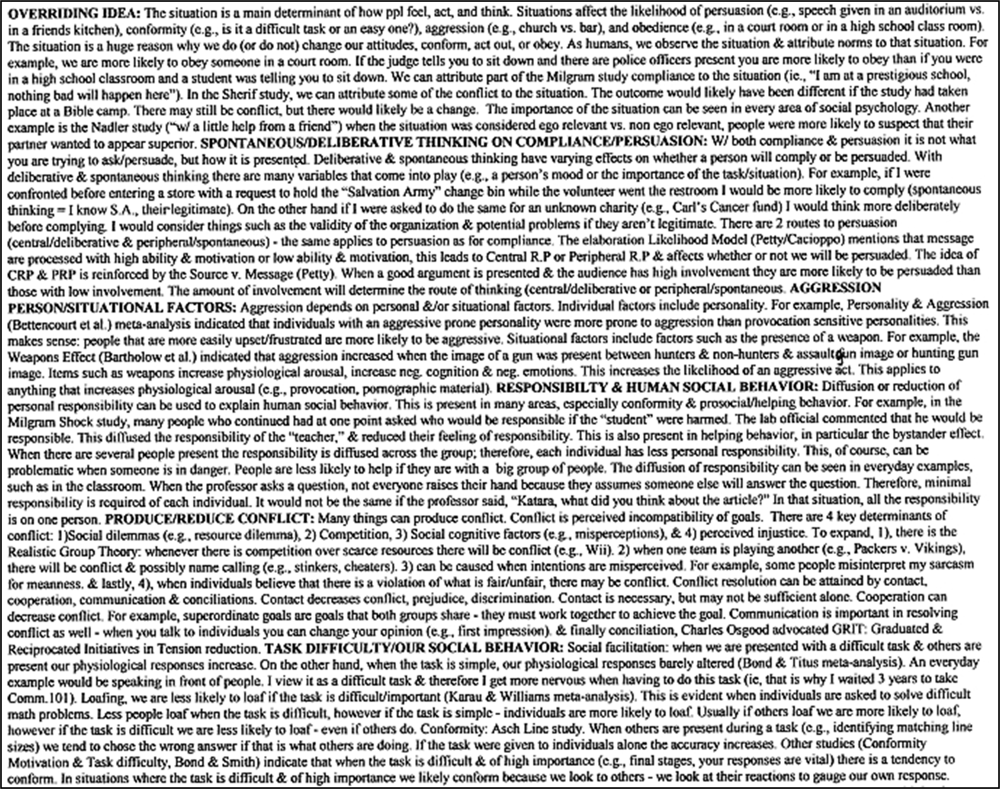

# Note Sheet Examples

- Craig A. Wendorf, Ph.D.
- University of Wisconsin - Stevens Point
- cwendorf@uwsp.edu

## Overview of Note Sheets for Exams

### The Logic of Allowing Note Sheets

In my Social, Cultural, and Personality Psychology courses, I allow students to use one page of notes during both the multiple-choice and essay portions of an exam. This practice is grounded in my belief that I write questions that are quite broad (which many students interpret as “challenging”). These questions require students to synthesize material by describing the relevant concepts or theories that they believe are relevant, by providing everyday examples of the concept at hand, and to examine exemplary empirical evidence. 

These exams amount to a hefty task if the student is expected to memorize many details. Thus, to alleviate students’ need to memorize all of the details – indeed, to reduce their cognitive load during the exam – I permit a note sheet. As a result, I believe that the students can better focus on the integration and interrelationships during the exam period.

But even more importantly, I believe that the proper creation of note sheets can itself promote learning. Research in psychology suggests that the more someone organizes information, the better they can recall and describe it later. Thus, by permitting note sheets (and providing rules for their creation), students may better prepare themselves for the exam.

### Rules for Note Sheets

The following rules for note sheets are strictly enforced:

- Notes must be on only one side of a single 8.5” x 11” sheet of paper. Note sheets are not a replacement for preparation and learning. For my tests, more than a page of notes reflects an over-reliance on notes.
- Note sheets must be self-produced. This means that the notes must be hand-written or typed, but not photocopied. By this stage of the learning process, students learn best by working to organize and simplify the information from the course.
- Note sheets must be approved by me before the exam and must be handed in with the exam. Prior to distributing the exams, I ask to see all note sheets. I also examine all note sheets after giving grades for the exam. These measures help me to determine compliance with the rules, but also provide me with important information for offering constructive feedback on students’ performance.

The remainder of this document provides examples of actual student note sheets from previous exams. I have chosen these examples NOT because they are exemplary (most of them are not, in my opinion), but because they are typical. I have also provided commentary on each of them.  

## Sample Note Sheet #1

### A Portion of a Student’s Note Sheet

The box below presents a portion of a student’s note sheet for a Social Psychology exam on social influence (conformity, obedience, persuasion, etc.). This exam covered approximately half of the course material. For this exam, students had access to a pool of essay questions ahead of time.

### My Thoughts about this Note Sheet

- This student clearly utilized an outline type of note sheet. This represents a fairly strong attempt to list what the student believed were the most important details and ideas for each question. This also represents that the student either pruned out details that were not perceived as being important or that the student already had memorized.
- This student’s note sheet was primarily organized around the pool of essay questions. Although this may be practical, it is likely that these notes were less advantageous during the multiple choice portion of the exam.
- Because the essay question for this exam would have required students to explain relevant empirical studies in some significant detail, a considerable amount of useful detail is probably missing from this note sheet.
 
## Sample Note Sheet #2

### A Portion of a Student’s Note Sheet

The box below presents a portion of a student’s note sheet for a Psychology and Culture exam on psychological manifestations of culture (culture’s impact on the self, on cognition, etc.) and intercultural processes (acculturation, etc.). This exam covered approximately one-third of the course material. For this exam, students had access to a pool of essay questions ahead of time.

### My Thoughts about this Note Sheet

- This student partially utilized an outline type of note sheet. There is certainly some level of organization of the information but, to me at least, the organization is a bit haphazard.
- Although this student’s note sheet was partially organized around the pool of essay questions, it is also organized around the relevant topics and theories. Again, this would seem to be both practical and useful for both the multiple-choice and essay portions of the exam.
- The student’s inclusion of diagrams and graphs represents some attention to detail. These were definitely useful in answering questions on both portions of the exam. 

## Sample Note Sheet #3

### A Portion of a Student’s Note Sheet

Like the previous example, the box below presents a portion of a student’s note sheet for a Psychology and Culture exam on psychological manifestations of culture (culture’s impact on the self, on cognition, etc.) and intercultural processes (acculturation, etc.). This exam covered approximately one-third of the course material. For this exam, students had access to a pool of essay questions ahead of time.

 

### My Thoughts about this Note Sheet

- Like in the previous example, this student partially utilized an outline type of note sheet. Interestingly, this student appears to have revised the original type-written note sheet by adding relevant hand-written material throughout the note sheet.
- Although this student’s note sheet was partially organized around the pool of essay questions, it is also organized around the relevant topics and theories. Nonetheless, the overall organization may be functional, but could have been better.
- The inclusion of simple diagrams to convey theory is an effective use of space here. However, there are no graphs or tables to assist in answering questions about empirical evidence.

## Sample Note Sheet #4

### A Portion of a Student’s Note Sheet

Like the first example, the box below presents a portion of a student’s note sheet for a Social Psychology exam on social influence (conformity, obedience, persuasion, etc.). This exam covered approximately half of the course material. For this exam, students had access to a pool of essay questions ahead of time.

 

### My Thoughts about this Note Sheet

- This student’s note sheet was completely organized around the pool of essay questions to the point of nearly writing out the answer to each question. If well done, it can be very effective. In other cases, students report that they wasted their time writing rather than organizing and studying.
- Similarly, this organization may or may not be useful for answering multiple-choice questions. In this case, the student’s notes addressed only about half of the studies tested in the multiple-choice section.
- Although this note sheet lacks any diagrams, graphs, or figures, it does convey some level of detail about the relevant theories and empirical evidence. Nonetheless, the level of detail here is not sufficient and the student needed to rely on her memory to fill in the blanks.
