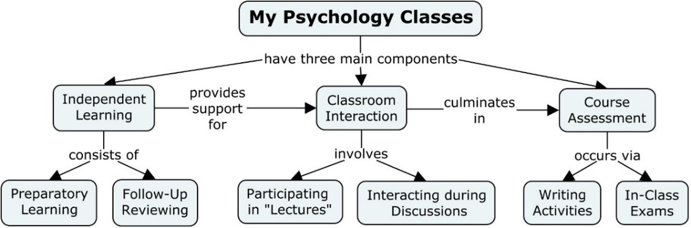

# Teaching Philosophy

- Craig A. Wendorf, Ph.D.
- University of Wisconsin - Stevens Point
- cwendorf@uwsp.edu

## Overview of My Teaching Philosophy

As I see it, my job is to facilitate your achievement of the course objectives. Thus, I am going to do what my professional training and experience suggest helps your long-term learning of important and relevant content and skills. 

First and foremost, research in psychology shows that many people do not have a good sense of how they learn. Many people believe that simply listening to an “expert” talk and writing down these statements as closely as possible constitutes effective learning and that answering only multiple-choice questions is a good measure of that learning. Unfortunately, none of these beliefs are accurate. 

Therefore, instructors need to be effective organizers of learning experiences for students. Thus, my goal as an instructor is provide you with the types of experiences that I think are best capable of helping you to achieve the learning objectives for this class. Therefore, in some cases I might require you to read challenging material and, in other situations, I might require you to brainstorm ideas and examples with other students. In general, it should be clear that I have thought long and hard about what I do in each and every class period.

Similarly, you must also take responsibility for your own learning; you cannot expect to learn and succeed if you remain passive in this course. There is an overwhelming amount of research in psychology that shows that long-term learning is most strongly related to the actions of the student (and not the instructor). Put quaintly, I cannot open up your head and pour in the knowledge and know-how. You must work to learn the material in such a way that it makes sense to you.

## Course Structure and Methods

The components that will be used to facilitate your learning are described in this section. All of my courses have a common core or structure. Specifically, I have tried to explain the nature of these elements and also be very clear about what these components and elements mean for you as a successful student.
 

### Independent Learning

Independent learning is the backbone of education. Outside multimedia presentations – such as readings, videos, etc. – are and ought to be the main source of course-related content. No amount of lecturing or other classroom activities can substitute for independent learning in my courses, especially those classes that are either wholly or partially online. Therefore, doing the assigned work should be one of your top priorities for my class.

The textbook for this course comprises the main source for the preparatory readings. I have carefully chosen the textbook that I believe is a good and very readable introduction to the course topics. However, the text does NOT include everything relevant to a college-level course and, therefore, several other readings and journal articles will also be required for the course. All additional readings (both preparatory and follow-up) will be available on the course D2L site.

- Prepatory Learning: Each time we meet, I will be highly prepared to discuss the scheduled topics and associated materials; I expect the same from you. Thus, all preparatory readings and videos must be completed prior to class meetings and you should be prepared to discuss them in class. 
- Follow-Up Reviewing: Follow-up materials may be completed following the class in which they are discussed. These readings and videos clarify and build on the concepts addressed in class. These materials are generally more technical, but it will be necessary to use them to successfully meet the course objectives.

Understand that a significant portion of the course information (and therefore what is on an exam or what is needed for completing the learning activities described below) is only available in these materials. If you do not use and review these course materials, you will not get a good grade in the class.

### Classroom Interactions

Attendance and participation in the classroom environment is also vital to your learning. I do not simply use class time to reiterate what is in the readings and videos. Class time is used to address material that is generally more difficult or not present in the other materials. Thus, you should strive to not just attend, but participate in, each and every class period.

In pursuit of the course objectives (and consistent with my teaching philosophy), I will use various methods of teaching during the semester. I describe my main teaching methods below so that you are properly prepared for each and every class period. Many class materials will be available on the course D2L site before the class period.

-  Class time is used to go above and beyond the course materials. Lectures are interactive; you are expected to participate by adding your insights, answering questions, and asking relevant questions. Similarly, I use other materials and present information that is only available in class.
- Lectures will often be limited in order to more appropriately focus on small-group interactions. Small-group interaction will be used to facilitate learning of concepts and their applications. Groups will often be asked to compare answers and share their insights and struggles to the class as a whole.

Class meetings are the appropriate times to get clarifications about the course material. For example, if you are confused about anything, you are strongly encouraged to ask about during class time. It is highly likely that if you are confused about something, someone else in class probably is too. That may be cliché, but it is often true.

I expect that you will show respect to the instructor and other students by acting in a professional classroom manner at all times. This includes, but is not limited to, listening and respecting the diversity of backgrounds, ideas, and opinions of the people in the room. Similarly, please limit any potentially disruptive items (such as cell phones) and behaviors (such as irrelevant conversations or packing up to leave before the class is over).

### Course Assessments

Of course, all classes have some established method for assessing the students’ skills and knowledge that are relevant to the course. Though students often look upon these assessments as a necessarily evil or as the focal point for the course, I encourage you to think of them simply as measures of your learning. 

Your progress toward achieving the objectives (knowledge of and ability to apply course material) will be assessed according to the following components: learning activities and in-class exams. 

- There will be many writing activities assigned and due at several different points in the course. These activities are designed to provide you with practice in dealing with course-related concepts. These assignments will only be available on the course site. 
- Exams for the course will of mixed variety (multiple choice, essay, and problem-based questions as relevant to the course). Exams will reflect all the material covered course. An exam review sheet and study guide will be available on the course site at least one week prior to each exam.

## Participation and Attendance

Notice that because grading is designed to be a measure of your learning and academic performance, attendance has no logical place in the grading process. Thus, I do not give points for simply attending class. Rather, attendance in class prepares you for properly completing the learning activities and optimally prepares you for the exams.

In general, I believe that your attendance in class should improve your knowledge of difficult and unique material because it gives you an opportunity to participate in your own learning. Additionally, as I have noted in the course syllabus, university policy requires regular attendance for any class in which you are enrolled. Thus, you are expected to be in class regularly, both in body and mind. If this expectation poses a problem for you this semester – for whatever reason you may have – please consider taking the course in a semester when you can give it proper attention.

While I do not give points for attendance, I will take attendance periodically throughout the course. As I see it, keeping track of what you have and have not been present for will increase my ability to help facilitate your learning in my course. Therefore, do not be surprised if you hear that I will be contacting students who have been missing classes without letting me know why. 

That being said, I recognize that many students have multiple demands on their time and that their lives can be tremendously complex. I also believe that you are the best person to determine where you need to be at any particular moment. If you have an important matter that simply must be addressed when our class is in session, by all means take care of the matter. But I also hope that I can convince you that attending and participating in class is indeed a worthwhile use of your time.
